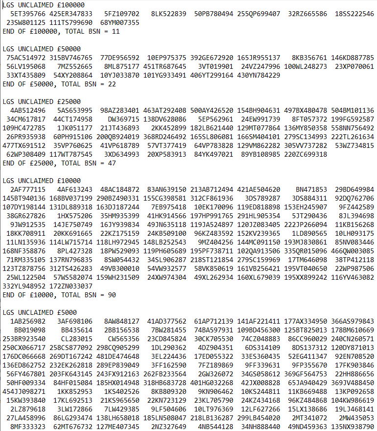
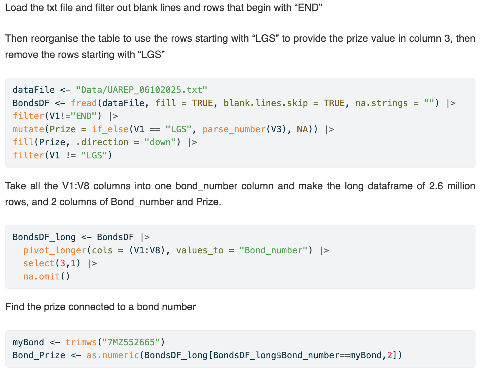

```{r}
#| context: setup
library(ggplot2)
library(gt)
library(bslib)
library(data.table)
BondsDF_long <- fread("Data/BondsDF_long.csv")
```

#  {.sidebar}

#### Enter your premium bond number here

```{r}

 textInput("bondID", tags$b("Bond Number"), "", placeholder ="59EE417688")

```

```{r}
tags$b("Your prize is")
tags$b(textOutput("prize"))
tags$br()

```

```{r}
tags$b("See what you could have won")
actionButton("go", "Refresh", icon("refresh"), class = "btn-primary")
tags$b(textOutput("bond"))
tags$br()
```

[Learn more](https://www.nsandi.com/products/premium-bonds/) about premium bonds

[See my Shiny apps](https://drclongstaff.github.io/shiny-clots/) for reproducible analysis of biochemical assays

[Contact me](mailto:%20drclongstaff@gmail.com, "drclongstaff@gmail.com") for issues or comments about the dashboard. Or tell me if you have reclaimed a prize!

# Premium bond monthly prize draws began in 1956 and there are many unclaimed prizes. The top prize is £1 million

```{r}
#| context: server
# Read once at startup, not on every input change

myPrize <- reactive({
  req(input$bondID)  # wait until there's actually input
  
  myBond <- trimws(input$bondID)
    result <- as.numeric(BondsDF_long[BondsDF_long$Bond_number==myBond,3])
    
  if (is.na(result)) {  
    "Sorry you didn't win this time"
  } else {
    as.character(paste("£",result))
  }
})

output$prize <- renderText({
  myPrize()
})

abond<- reactive({
  input$go
  abond <- sample(noquote(BondsDF_long$Bond_number),1)
  
})

output$bond <- renderText({
  abond()
})
```

## Row {height="14%"}

```{r}
#| content: valuebox
#| title: "I found two old premium bonds in a drawer"
#| color: pink
#| icon: currency-pound
p("they were bought for me when I was born in 1959")
```

```{r}
#| content: valuebox
#| title: "The NS&I data is difficult to search"
#| color: blue
#| icon: unlock-fill
p("so this dashboard will help find unclaimed prizes")
```

## Row {height="86%"}

### Table

```{r}
SumDF <- data.frame(table(BondsDF_long$Prize))
colnames(SumDF) <- c("Prize", "Number")
SumDF$Prize <- as.numeric(levels(SumDF$Prize))[SumDF$Prize]
SumDF <-  SumDF |> dplyr::mutate(Total_value=Prize*Number)
totalValue <- SumDF |> dplyr::summarise(sum(Total_value, na.rm = TRUE)) 
totalValue <- format(totalValue, sci=FALSE,  big.mark = ",")
totalNumber <- SumDF |> dplyr::summarise(sum(Number, na.rm = TRUE)) 
totalNumber <- format(totalNumber, sci=FALSE,  big.mark = ",")
SumDF |> gt() |> 
  cols_label(Prize ~ "Prize Value", Number ~ "Number of Prizes", Total_value ~ "Total Value") |> 
  tab_header(title = "Unclaimed prizes from 1956 to 2025") |> 
  opt_stylize(style = 6, color = "pink") |> 
  opt_table_font(stack = "humanist") |> 
  tab_footnote(
    footnote = "There are 2,608,195 unclaimed prizes totalling £108,147,675"
    
  )
  
```

### Column {.tabset}

#### Analysed

```{r}
# #| title: Number of unclaimed prizes by value are ~linear on a log-log plot

p <- ggplot(SumDF, aes(Prize, Number)) +
  geom_point(size = 5, color="blue")+
  scale_y_continuous(transform = 'log10', labels = scales::comma)+
  scale_x_continuous(transform = 'log10', labels = scales::comma)+
  geom_text(
    mapping = aes(label = paste0("£",Prize)), 
    nudge_x = -0.25, 
    inherit.aes = TRUE,
    sci=FALSE
  ) + 
  labs(x="Prize value, £",
       y="Number of prizes",
       title = "Number of unclaimed prizes by value",
       subtitle = "The £250 prize was available from June 1957 to July 1974."
       )+
  theme_minimal()

axisText <- element_text(face = "bold", color = "grey20", size = 14)
titleText <- element_text(face = "bold", color = "grey10", size = 20, hjust = 0.5)
subtitleText <- element_text(face = "bold", color = "grey20", size = 16, hjust = 0.5)
p+theme(axis.title = axisText, axis.text = axisText,
        plot.title = titleText,
        plot.subtitle = subtitleText)
```

#### Raw data

The text file provided by NS&I is not easy to search



#### Cleaning code


